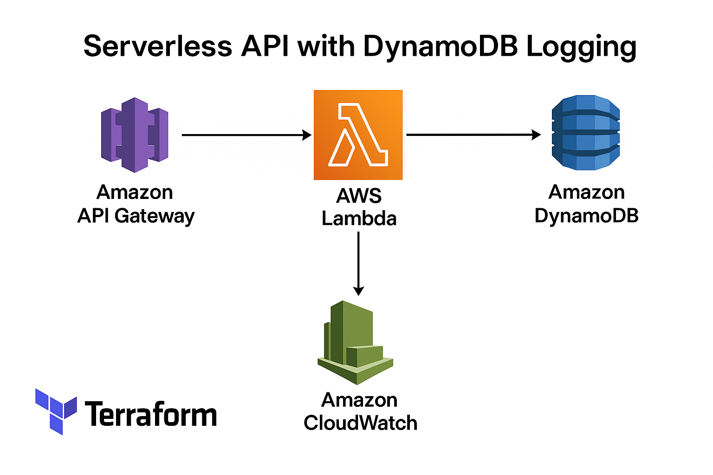

# 🔗 Serverless API with AWS Lambda & API Gateway

A fully serverless REST API built with Terraform, using:
- ⚙️ AWS Lambda
- 🌐 API Gateway
- 🗃️ DynamoDB (for request logging)
- 🛠️ Terraform (for infrastructure-as-code)
- 🔍 CloudWatch (for observability)

## 🧠 Architecture



This API exposes a public `/hello` endpoint that triggers a Lambda function, logs each request to DynamoDB, and returns a success message.

## 📦 Features

- Serverless REST API using AWS Lambda + API Gateway
- Logs every request to DynamoDB (UUID, timestamp, user agent)
- CloudWatch log group with 14-day retention
- CLI automation scripts for fast deployment and teardown
- Clean, modular Terraform code with outputs and variables

## 🚀 Deploy the API

```bash
./deploy.sh
```

After deployment, invoke the API:

```bash
curl https://<your-api-id>.execute-api.us-east-1.amazonaws.com/prod/hello
```

You should see:

```json
{"message":"Hello from Lambda with DynamoDB logging!"}
```

## 🔥 Destroy the API

```bash
./destroy.sh
```

## 📁 Project Structure

```
serverless-api-lambda/
├── lambda/
│   ├── index.js
│   ├── package.json
│   └── node_modules/
├── terraform/
│   ├── main.tf
│   ├── lambda.tf
│   ├── api_gateway.tf
│   ├── dynamodb.tf
│   ├── iam.tf
│   ├── outputs.tf
│   ├── variables.tf
│   ├── terraform.tfvars
│   └── .gitignore
├── assets/
│   └── architecture-diagram.png
├── deploy.sh
├── destroy.sh
├── LICENSE
└── README.md
```

## 🧰 Built With

- AWS Lambda
- API Gateway
- DynamoDB
- Terraform
- Node.js
- CloudWatch

## 📜 License

This project is licensed under the [MIT License](LICENSE).

## 🙌 Acknowledgments

Thanks to the AWS and Terraform communities for their open documentation and tooling!
